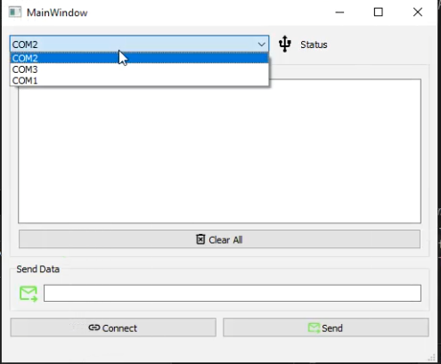
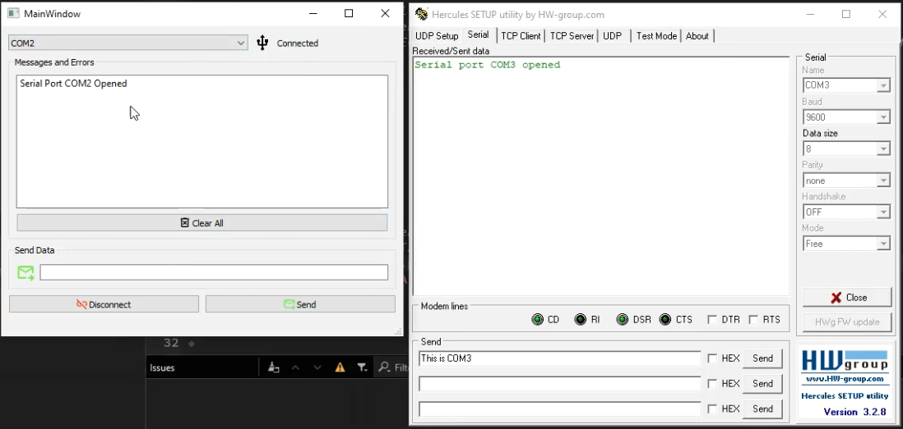
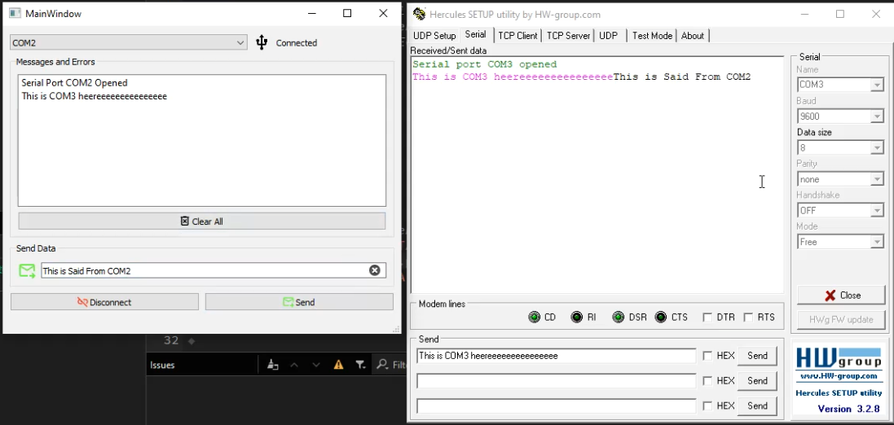

# Qt Serial Port App
  

## Overview

This project is a simple application for configuring and managing serial port connections using the Qt framework. It provides an intuitive user interface to select serial ports, set parameters, and communicate with devices.

## Features

- Select available serial ports
- Configure baud rate, data bits, stop bits, and parity
- Send and receive data through the serial port
- User-friendly interface built with Qt

## Installation

1. Clone the repository:
   ```bash
   git clone https://github.com/SaidMagdy1/Qt_SerialPort_App.git

## Usage

1. **Open the application**: Launch the Qt Serial Port App.
2. **Select the desired serial port**: From the dropdown menu, choose the serial port you want to use.
3. **Configure the serial port settings**:Set the baud rate, data bits, stop bits, and parity according to your requirements.
4. **Send data**: Enter the text you want to send in the input area and click the "Send" button.
5. **Receive data**: Incoming data will be displayed in the output area. Make sure to monitor this area for any responses from the connected device.